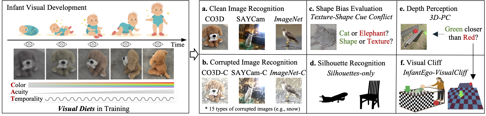
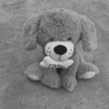
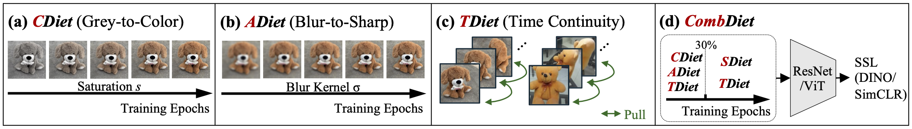

# Learning to See Through a Baby’s Eyes: Early Visual Diets Enable Robust Visual Intelligence in Humans and Machines

## [Paper]() | [Models](https://drive.google.com/drive/folders/1M3pQ7U_DtCdpyE2ULR2WGNUX871C2_qz?usp=drive_link) | [Poster]() | [Video]()
PyTorch implementation of CombDiet, developmental visual diets for SSL models.
This work has been accepted to CVPR 2026.

**[Learning to See Through a Baby’s Eyes: Early Visual Diets Enable Robust Visual Intelligence in Humans and Machines]()**

Yusen Cai, Qing Lin*, Bhargava Satya Nunna, [Mengmi Zhang](https://a0091624.wixsite.com/deepneurocognition-1)*
(*Corresponding authors)  

## Abstract
Newborns perceive the world with low-acuity, color-degraded, and temporally continuous vision, which gradually sharpens as infants develop. To explore the ecological advantages of such staged "visual diets", we train self-supervised learning (SSL) models on object-centric videos under constraints that simulate infant vision: grayscale-to-color (C), blur-to-sharp (A), and preserved temporal continuity (T)—collectively termed CATDiet. For evaluation, we establish a comprehensive benchmark across ten datasets, covering clean and corrupted image recognition, texture–shape cue conflict tests, silhouette recognition, depth-order classification, and the visual cliff paradigm.
All CATDiet variants demonstrate enhanced robustness in object recognition, despite being trained solely on object-centric videos. Remarkably, models also exhibit biologically aligned developmental patterns, including neural plasticity changes mirroring synaptic density in macaque V1 and behaviors resembling infants’ visual cliff responses. Building on these insights, CombDiet initializes SSL with CATDiet before standard training while preserving temporal continuity. Trained on object-centric or head-mounted infant videos, CombDiet outperforms standard SSL on both in-domain and out-of-domain object recognition and depth perception. Together, these results suggest that the developmental progression of early infant visual experience offers a powerful reverse-engineering framework for understanding the emergence of robust visual intelligence in machines.

<div align=left></div>  

## CATDiet & CombDiet
<table align="center">
<tr>
<td align="center">
  <br/>
  <sub>CDiet</sub>
</td>
<td align="center">
  <br/>
  <sub>ADiet</sub>
</td>
<td align="center">
  <br/>
  <sub>TDiet</sub>
</td>
<td align="center">
  <br/>
  <sub>CATDiet</sub>
</td>
</tr>
</table>

<div align=left></div>  
CombDiet is a two-phase self-supervised learning (SSL) framework that embeds principles of human visual development into both the data curriculum and the learning objectives. In the first phase, CATDiet serves as a warm-up stage that mirrors infants’ first-year visual progression, marked by rapid perceptual development toward near-mature vision. This phase spans the initial 30% of training epochs and integrates two data curricula, Color-Diet (CDiet) and Acuity-Diet (ADiet), with a temporal regularization objective, Temporality-Diet (TDiet), to emulate the temporal continuity inherent in early visual experience. In the second phase, Standard Diet (SDiet) represents mature visual experience. CombDiet transitions to SDiet while retaining TDiet, thereby maintaining temporal coherence throughout learning.

## Environment Setup
```
conda create -y -n CombDiet python=3.9 cupy pkg-config compilers libjpeg-turbo opencv pytorch torchvision torchaudio pytorch-cuda=11.7 numba -c pytorch -c nvidia -c conda-forge
conda activate CombDiet
pip install -r requirements.txt
```

## Training & Testing
For training,
* Set up the environment.
* Download dataset following the [instructions](data/preprocess.md).
* Set the data directory paths (`pretrain_dir`, `linprobe_train_dir`, `linprobe_test_dir`, and `ood_dir`) in `scripts/CATDiet.sh` and `scripts/CombDiet.sh`.

Train the model from scratch using CATDiet, please run the command below:
```
bash scripts/CATDiet.sh
```

Train the model from scratch using CombDiet, please run the command below:
```
bash scripts/CombDiet.sh
```

For testing,
* Download our pretrained models [here](https://drive.google.com/drive/folders/1M3pQ7U_DtCdpyE2ULR2WGNUX871C2_qz?usp=drive_link).
* Set the data directory paths (`pretrain_dir`, `linprobe_train_dir`, `linprobe_test_dir`, and `ood_dir`) and the model dir (`ckpt_path`, `lin_ckpt_path`) in the corresponding script.


To evaluate CATDiet on clean and corrupted image recognition, set `skip_pretrain=True` and `skip_linear_train=True` in `scripts/CATDiet.sh`, then run:
```
bash scripts/CATDiet.sh
```

To evaluate CombDiet on clean and corrupted image recognition, set `skip_pretrain=True` and `skip_linear_train=True` in `scripts/CombDiet.sh`, then run:
```
bash scripts/CombDiet.sh
```

To evaluate the model on silhouettes recognition, run:
```
bash scripts/eval_silhouette.sh
```

To evaluate the model on shape bias recognition, run:
```
bash scripts/eval_shape_bias.sh
```

To evaluate the model on depth estimation, run:
```
bash scripts/eval_depth.sh
```

## BibTex
```bibtex
@article{cai2025learning,
  title={Learning to See Through a Baby's Eyes: Early Visual Diets Enable Robust Visual Intelligence in Humans and Machines},
  author={Cai, Yusen and Nunna, Bhargava Satya and Lin, Qing and Zhang, Mengmi},
  journal={arXiv preprint arXiv:2511.14440},
  year={2025}
}
```

## Acknowledgments
We benefit a lot from [facebookresearch/FFCV-SSL](https://github.com/facebookresearch/FFCV-SSL), [libffcv/ffcv](https://github.com/libffcv/ffcv), [lightly-ai/lightly](https://github.com/facebookresearch/FFCV-SSL), and [eminorhan/video-models](https://github.com/eminorhan/video-models).
